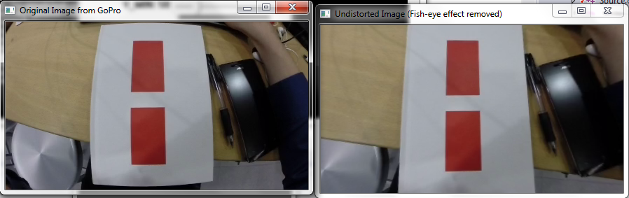
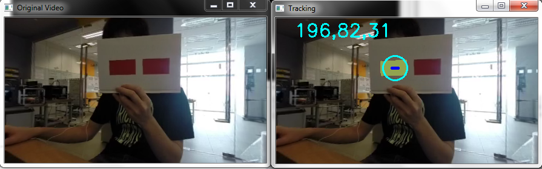

ParticleFilter
==============
This is an example of a Particle Filter using colour segmentation and OpenCV that I extended from this repository https://github.com/lililqth/ParticleFilter. Particle filter is a popular technique used in robot localization. I modified some of the code especially the statistical functions, mathematical expressions and added some comments in english.

Idea behind Particle Filter
---------
This is a pretty good analogy to understand Particle Filter from Udacity.

1. Think of a big field where there is a bucket of sugar (robot) somewhere.
2. You release a lot of bees (particles) and they initially spread over the entire field.
3. The bees then realised that there is sugar on the field and get an idea(sense) about how far they are from the sugar but not what direction it is, but they can communicate with one another.
4. As the time passes(loop), the bees tend to move towards the bees that say that they are closest to the bucket(move + resampling with substitution step i.e none of the bees die)
5. While you cannot know where the bucket is, you can see where the bees are, and when they all concentrate in one big lump, you can be pretty certain that the bucket is there.
6. Otherwise, there are some really confused bees that have lost their bearings and confused the rest of the swarm.

In reality (To find x and y)
-----
Particle filters make use of a lot of probability. We make measurements and assign a higher weight to the more probable particles. We then resample the particle based on their weighted probabilities. Over time, the most consistent particles will survive and we will have successfully localized the robot.

Based on my experience, particle filters seem more robust than simple colour segmentation/blob detection when used to track robots in different lighting conditions.

How to find z coordinates with one camera?
-------
Finding z is easier with two cameras aka stereo vision. It is how humans perceive 3D objects in real life. However, if we only have one camera, we can still get a fairly good estimate of z using the following idea:

Notice that there are two similar triangles (in yellow) formed by the actual object, lens of the camera, and the image. By proportionality of similar triangles, 

`object distance/image distance = object height/image height`

When we are trying to get z, we are actually looking for the object distance from the camera. The image distance is usually known as the focal length. It is a measure of how strongly the lens converges or diverges light and remains fixed. 

What we can do to get z is to use the camera to get the image distance aka focal length first:

1. Place an object of known height at a known distance (say 30cm) away from the camera. You will get the object distance and object height in cm or m. In my case, I used a red sticker of 7.2 by 4cm.
2. Use the camera to capture the object.
3. Find out the height of the object in the image(using OpenCV). This will be in pixels.
4. Use the formula to get the image distance aka focal length of the camera lens.
5. From now on, you can use the focal length and the formula to estimate the distance that this object is away from the camera i.e the z coordinates.

Note: Every time you change the resolution of the camera or use another camera, you have to redo this process as different cameras have different focal lengths.

Distortion
------
There are two main types of distortion resulting from any camera lens. The first type is called the radial distortion which is also known as the fish eye effect. Basically, this is caused by light bending more away from the lens. The second type is called tangential distortion which is caused by the mis-alignment of the lens and the imager wihin the camera.

In my code, I calibrated the program to work with a GoPro camera with high fisheye distortion. I removed the distortion by capturing many images of a chessboard with the GoPro. I then use OpenCV to process them and store the calibration results in the xml file. If you are working with a simple webcam, try removing the calls to initUndistortRectifyMap and remap.

 
It looks something like this.

Current algorithm
------
1. Initialize VideoCapture object
2. Initialize undistort map using OpenCV and a calibrated XML file.
3. For every frame,
    a. undistort the frame using the undistort map.
    b. run the particle filter to get the x and y coordinates.
    c. use the average centre coordinate of the particles cluster and the width and height of the cluster to draw a bounding rectangle around the centre.
    d. Process the image within this bounding rectangle. In particular, we use a floodfill to get the area of the colored sticker at the centre of the bounding rectangle.
    e. use the formula shown in the earlier section to get the z coordinates.
    f. return or print out the coordinates.

Results
--------
The following screenshot shows the current results of the program used to track the red sticker. Note that there are in fact a lot of particles bombarding every frame, but I commented out the line that is drawing the particles to save on processing power. 

More screenshotos are shown in the images folder. I have tested the program at short distances (0~1.5m) away from the camera. As of now, the coordinates returned are still relatively accurate. However, the algorithm is not reliable enough when the sticker gets too far (like about 2m). This is probably because the colour segmentation is not clear when the sticker becomes too small in the image. A solution to increase the range could be to use a larger sticker or to remap the image into a larger size using OpenCV.

Futhermore, z depends on x and y as of now. Z is only accurate iff x and y are accurate because of the floodfill algorithm.
